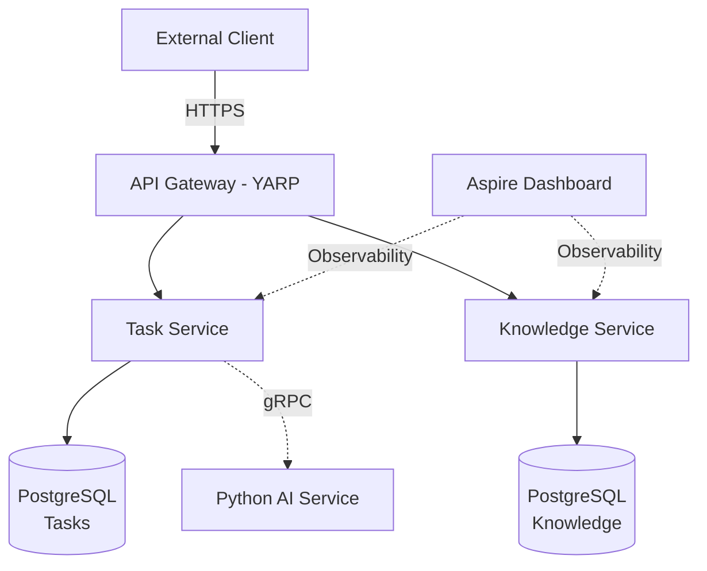

# 🚀 Enterprise Operations Platform

[](https://dotnet.microsoft.com/)
[](https://learn.microsoft.com/en-us/dotnet/aspire/)
[](LICENSE)

> **A modern microservices platform consolidating legacy systems into a cloud-native, AI-enhanced ecosystem using .NET Aspire orchestration.**

---

## 📖 Overview

This project demonstrates **legacy modernization** by transforming two isolated applications into a unified, scalable microservices architecture:

- **Task Management Service** (formerly [Smart-Task-API](https://github.com/lazar-iliev-dev/Smart-Task-API)) - Clean Architecture implementation for task workflows
- **Knowledge Management Service** (formerly [IT-Knowledge-Database](https://github.com/lazar-iliev-dev/IT-Knowledge-Database)) - Support documentation and problem-solving repository

### Key Achievements
✅ **Microservices Migration:** Refactored monolithic desktop app (SQLite) to containerized API (PostgreSQL)  
✅ **Clean Architecture:** Domain-driven design with clear separation of concerns  
✅ **Infrastructure as Code:** Declarative service orchestration via .NET Aspire AppHost  
✅ **Observability-First:** Built-in OpenTelemetry for distributed tracing and metrics  

---

## 🏗️ Architecture


---

## Technology Stack

| Layer         | Technologies                           |
| ------------- | -------------------------------------- |
| Orchestration | .NET Aspire, Docker Compose            |
| Backend       | ASP.NET Core 9, C# 13                  |
| Data Layer    | PostgreSQL, Entity Framework Core 9    |
| AI/ML         | Python (planned integration)           |
| Observability | OpenTelemetry, Grafana, Prometheus     |
| Security      | JWT Authentication, YARP Reverse Proxy |

## 🚀 Getting Started

Prerequisites
.NET 9 SDK or later

Docker Desktop

(Optional) Aspire Workload

#### Quick Start
```
# 1. Clone the repository
git clone https://github.com/lazar-iliev-dev/Enterprise-Operations-Platform.git
cd Enterprise-Operations-Platform

# 2. Install Aspire Workload (if not already installed)
dotnet workload install aspire

# 3. Run the AppHost (starts all services + infrastructure)
dotnet run --project src/AppHost

# The Aspire Dashboard will open automatically at https://localhost:15888
What Happens During Startup
Aspire AppHost starts orchestrating services
```

PostgreSQL containers are automatically provisioned

Task Service and Knowledge Service launch with health checks

Dashboard UI provides real-time logs, metrics, and distributed traces

## 📂 Project Structure

```
Enterprise-Operations-Platform/
├── src/
│   ├── AppHost/                          # Aspire Orchestration Layer
│   ├── ServiceDefaults/                  # Shared configurations (Logging, Telemetry)
│   └── Services/
│       ├── TaskService/                  # Clean Architecture: Domain, Application, Infrastructure, API
│       │   └── SmartTaskAPI/
│       │       ├── Domain/               # Business entities
│       │       ├── Application/          # Use cases & interfaces
│       │       ├── Infrastructure/       # EF Core, Repositories
│       │       └── Api/                  # Controllers, Middleware
│       └── KnowledgeService/
│           └── backend/                  # WebAPI for knowledge articles
├── docs/
│   ├── 01_LASTENHEFT.md                 # Requirements specification
│   └── 02_PFLICHTENHEFT.md              # Technical specification
└── README.md
```

## 📚 Documentation
📄 Requirements (Lastenheft) - Business case and functional requirements

⚙️ Technical Specs (Pflichtenheft) - Architecture decisions and implementation details

🛠️ Development
Running Individual Services
```
# Task Service only

`dotnet run --project src/Services/TaskService/SmartTaskAPI/src/Api`

# Knowledge Service only
`dotnet run --project src/Services/KnowledgeService/backend`

# Database Migrations
```bash
# Task Service migrations
dotnet ef migrations add InitialCreate --project src/Services/TaskService/SmartTaskAPI/src/Infrastructure

# Knowledge Service migrations
dotnet ef migrations add InitialCreate --project src/Services/KnowledgeService/backend
```

# 🎯 Roadmap
```
 Migrate legacy apps to Aspire

 Implement PostgreSQL persistence

 Add API Gateway (YARP)

 Integrate Python ML service for task prioritization

 Build BI dashboard with DuckDB analytics

 Implement event-driven architecture (MassTransit/RabbitMQ)
````

# 📊 Business Intelligence (Planned)

```
Future iterations will include:

ETL Pipeline: Aggregating data into a Data Warehouse (DuckDB)

KPIs: Task resolution velocity, knowledge gap analysis

Dashboards: Real-time operational metrics via Grafana
```

# 🤝 Contributing

This is a portfolio/learning project, but feedback and suggestions are welcome! Feel free to:

Open an issue for bug reports

Submit pull requests for improvements

Connect on LinkedIn

📄 License
This project is licensed under the MIT License - see the LICENSE file for details.

🙏 Acknowledgments
Built with .NET Aspire for cloud-native orchestration

Inspired by Domain-Driven Design and Clean Architecture principles

Legacy projects: Smart-Task-API & IT-Knowledge-Database

<div align="center"> <sub>Built with ❤️ by <a href="https://github.com/lazar-iliev-dev">Lazar Iliev</a></sub> </div>
